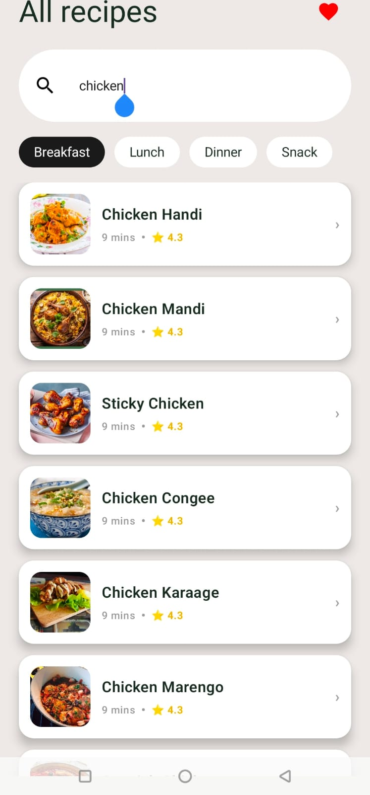
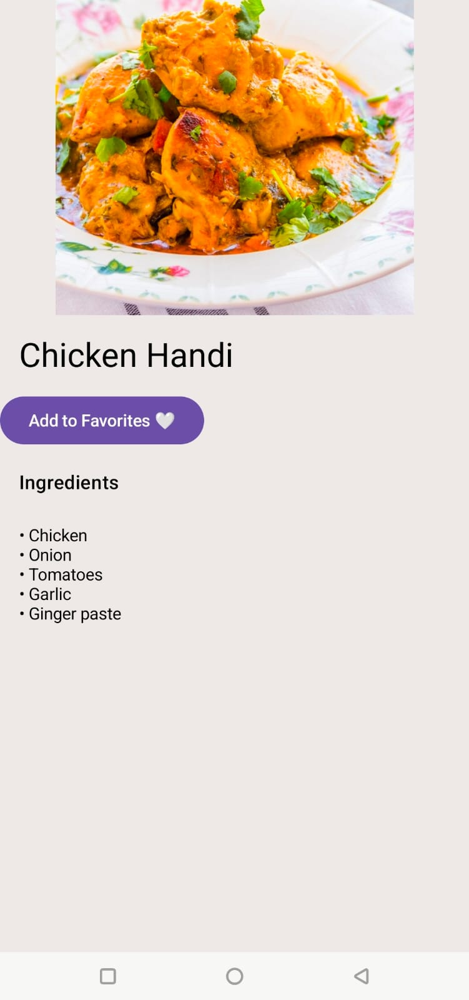
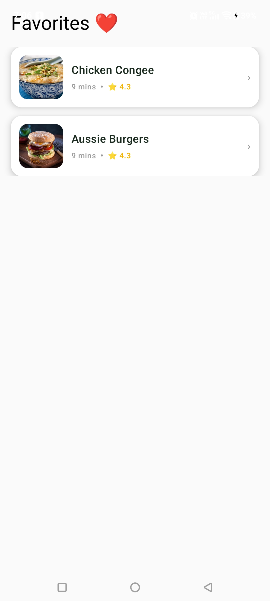

# Recipe Finder App (Jetpack Compose)

A simple and clean Android application built using **Jetpack Compose** that allows users to search recipes, view details, and save their favorite meals.

---

## 🎓 Internship Details

- Intern ID: CITS1726
- Project: Recipe Finder Android App

## Features

- 🔍 Search recipes by name or category  
- 🍲 View detailed recipe information  
- ❤️ Add recipes to Favorites  
- 📃 View ingredients list  
- 🖼️ Beautiful modern UI using Jetpack Compose  
- ⚡ Smooth navigation between screens  

---

## Tech Stack

- Kotlin
- Jetpack Compose
- MVVM Architecture
- Retrofit (API integration)
- Coil (Image loading)
- StateFlow / ViewModel
- Navigation Compose

---

## Screens

### Home Screen
- Search bar for recipes
- Category filters (Breakfast, Lunch, Dinner, Snack)
- Recipe list with images

### Recipe Detail Screen
- Full recipe image
- Recipe title
- Ingredients list
- Add to favorites button ❤️

### Favorites Screen
- Saved favorite recipes
- Option to view saved items

---

## Project Structure

com.example.recipefinder
│
├── ui
│ ├── screens
│ ├── components
│ └── navigation
│
├── viewmodel
├── data
│ ├── model
│ ├── api
│ └── repository
│
└── MainActivity.kt

## Overview of the app

  
  
  

